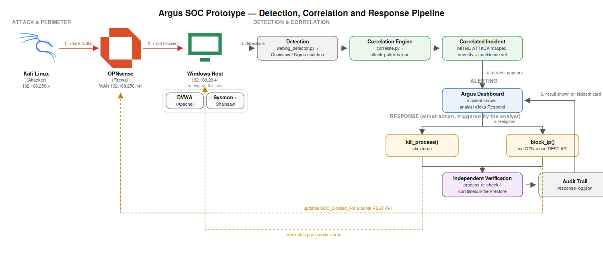

# Argus SOC Prototype

**Detection, Cross-Schema Correlation & Automated Response — built from scratch**

Argus is a lightweight Security Information and Event Management (SIEM) prototype developed as a PFA (Projet de Fin d'Année) internship project. It demonstrates strong, generic multi-source correlation and automated incident response — the two capabilities identified as the real gap in the host organization's current security operations, which today runs a SIEM with a single manual analyst and no automation.



## What this project does

- **Detects** attacks on two independent tracks: endpoint telemetry (Sysmon + Chainsaw + Sigma rules) and web application logs (a custom Python detector for SQL Injection, XSS, Path Traversal, and Command Injection).
- **Correlates** related detections — including across the two different log schemas above — into single, MITRE ATT&CK-mapped incidents, using a generic, JSON-configuration-driven engine (16 patterns).
- **Responds automatically**, via a dashboard-triggered orchestrator that can kill a malicious process on the endpoint or block the attacker's IP at the network perimeter (OPNsense), with independent verification and a persistent audit trail for every action.
- **Documents** a complete, reusable incident-response process — independent of this specific prototype — covering three playbooks (Malware Infection, Certificate/PKI Compromise, Unauthorized Access), delivered in English and French, mapped to ISO/IEC 27001:2022 and to the applicable Moroccan regulatory framework (DGSSI/Loi 05-20, CNDP/Loi 09-08).

## Architecture at a glance

An attacker (Kali) reaches a monitored Windows host (running DVWA + Sysmon) through an OPNsense firewall. Two detection paths — a web-log parser and Sysmon/Chainsaw — feed a correlation engine, which produces incidents on a Flask-based dashboard. From there, an analyst can trigger `kill_process` or `block_ip`, both independently verified and logged.

See **[`docs/architecture.md`](docs/architecture.md)** for the full technical write-up: every IP, every component, the complete data flow, and hard-won infrastructure facts worth not rediscovering.

## Repository structure

```
├── docs/                  # Architecture, lab setup, weekly log, dashboard frontend
├── sysmon-config/         # SwiftOnSecurity Sysmon configuration
├── sigma-rules/           # custom / adopted / community Sigma detection rules
├── simulations/           # Logged endpoint attack simulations (Atomic Red Team-based)
├── webattack/             # Web-attack detector + scenario playbook (exact attack commands)
├── correlation/           # Correlation engine, attack patterns, incident output
├── response/              # Automated response actions (kill_process, block_ip/unblock_ip)
├── scripts/                # Automation pipeline + dashboard backend
├── incident-reports/       # Real, evidence-based incident write-ups
├── mitre-mapping/          # MITRE ATT&CK technique coverage reference
├── security-process/       # Full bilingual Incident Response Process (EN + FR)
└── DEMO_RUNBOOK.md          # Step-by-step live demo procedure
```

## Running it

1. Start all three VMs (Kali, OPNsense, Windows-DVWA) and confirm free host RAM (see `docs/architecture.md`, Section 6).
2. Confirm Kali's route to the victim subnet is via OPNsense: `ip route get 192.168.20.41`.
3. Run the dashboard:
   ```powershell
   python scripts\dashboard-server.py
   ```
4. Open `http://127.0.0.1:5000` and click **Run New Hunt**, or run the pipeline directly:
   ```powershell
   .\scripts\export-and-copy.ps1 -GuestPassword "<password>"
   ```

For a full, repeatable demo sequence (attack → detect → correlate → respond → verify → reverse), see **[`DEMO_RUNBOOK.md`](DEMO_RUNBOOK.md)**.

## Documentation index

| Document | Purpose |
|---|---|
| [`docs/architecture.md`](docs/architecture.md) | Full technical architecture: topology, components, data flow |
| [`docs/lab-setup.md`](docs/lab-setup.md) | Environment setup instructions |
| [`docs/weekly-log.md`](docs/weekly-log.md) | Running project log |
| [`webattack/scenario-playbook.md`](webattack/scenario-playbook.md) | Exact, verified commands for all 4 web attacks |
| [`security-process/`](security-process/) | Full Incident Response Process (EN + FR), with 3 incident-type playbooks |
| [`incident-reports/`](incident-reports/) | Real incident write-ups used as project evidence |
| [`mitre-mapping/techniques-covered.md`](mitre-mapping/techniques-covered.md) | MITRE ATT&CK technique coverage |
| [`DEMO_RUNBOOK.md`](DEMO_RUNBOOK.md) | Live demo procedure |

## Current status

Detection, correlation, and both automated response mechanisms are complete and verified live end-to-end against real attacks. The security process documentation is complete in both languages. A quantitative benchmark against Wazuh is the remaining major piece of work before final reporting.

## Author

Zirar Chaimae — PFA Internship, 2026
